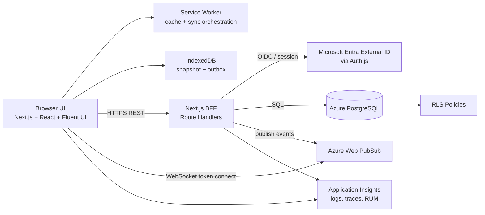
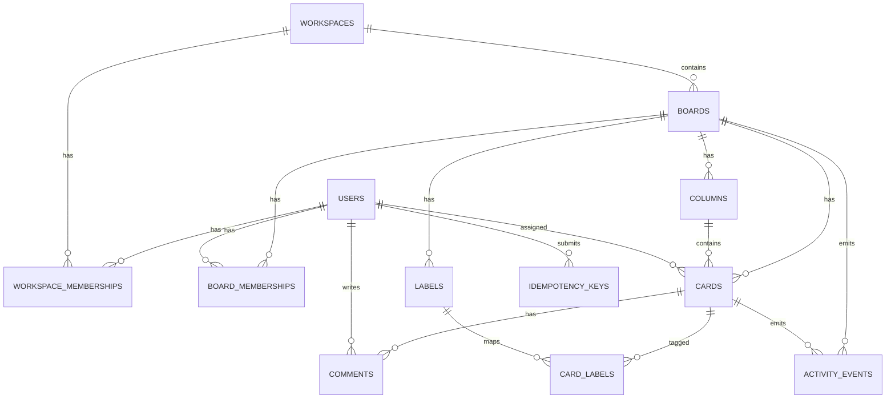
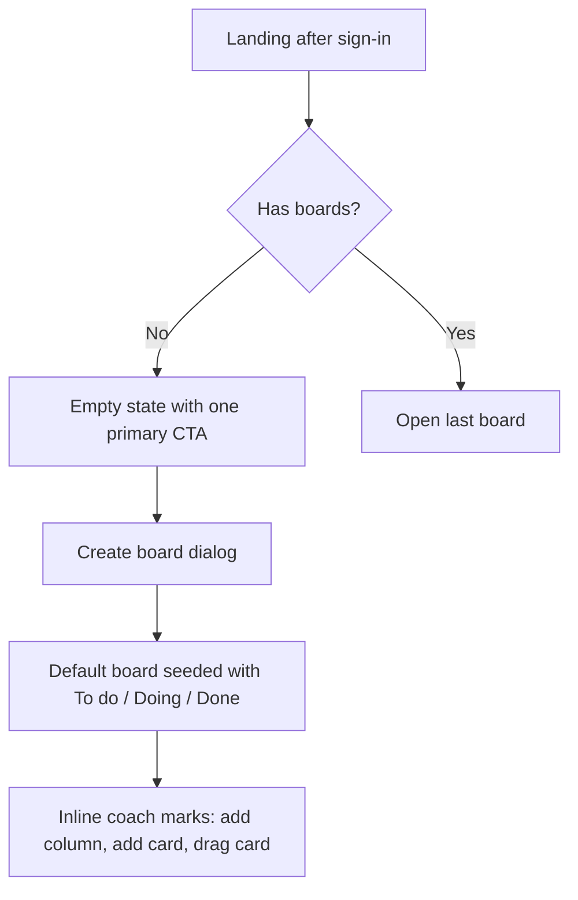
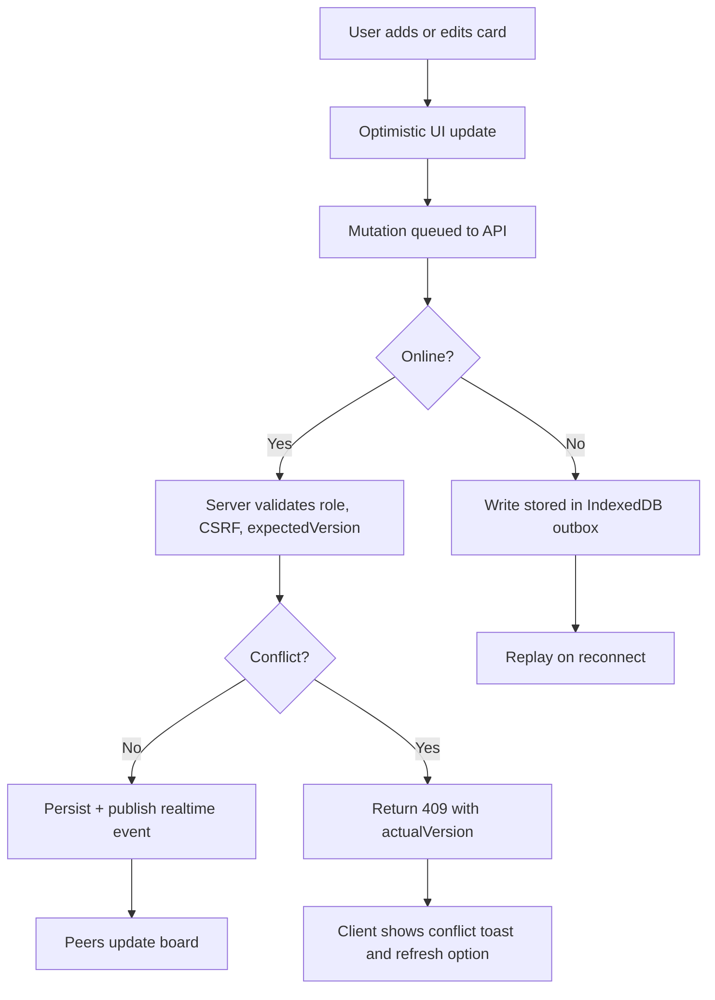
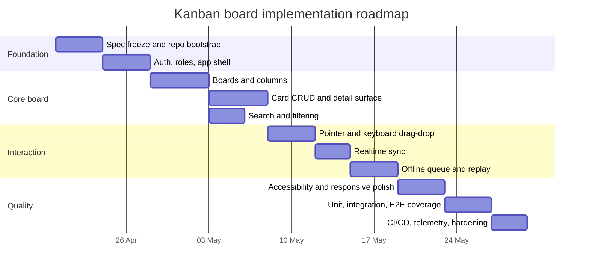

# Spec-Driven Kanban Board Blueprint for GitHub Copilot

## Executive summary

The best fit for a spec-driven, easy-to-use web Kanban board in 2026 is a **TypeScript-first, Microsoft-friendly stack** built around **Next.js App Router**, **React**, **Fluent UI React v9**, **Azure App Service**, **Azure Database for PostgreSQL Flexible Server**, **Microsoft Entra External ID**, **Azure Web PubSub**, and **GitHub Actions**. That combination gives you a strong balance of developer velocity, UI consistency, enterprise-ready security, and a code structure that GitHub Copilot can generate reliably file by file. Next.js natively supports full-stack web applications, Server Components, Client Components, and Route Handlers; Fluent 2 provides a mature component model and design-token system; Azure App Service is a stable managed runtime for Node.js apps; Azure Database for PostgreSQL provides native row-level security and built-in pooling options; and Azure Web PubSub is purpose-built for large-scale real-time messaging. citeturn30view1turn30view3turn17view0turn16search1turn12view1turn33view0turn33view5

I recommend **Azure App Service** over **Azure Static Web Apps** for the primary deployment target of this project, even though Static Web Apps is attractive for simple frontends. The reason is practical: hybrid Next.js support on Static Web Apps is still documented as **preview** and carries unsupported features and operational constraints, while Next.js itself can be deployed as a regular Node.js server with full feature support. That matters for a Kanban product that needs BFF-style APIs, secure session handling, offline re-sync, and predictable real-time behavior. citeturn15search2turn27search11turn12view3

The product target should be **WCAG 2.2 AA**, support **minimum 320 CSS px width**, meet modern **Core Web Vitals** targets, provide **keyboard and pointer alternatives** for drag-and-drop, support **offline shell + cached board state + queued mutations** through a **service worker** and **IndexedDB**, and provide a browser matrix covering **Edge, Chromium browsers, Firefox, and Safari**. This report prioritizes primary documentation from entity["organization","W3C","web standards body"], entity["organization","OWASP","appsec nonprofit"], entity["organization","Mozilla","web browser maker"], entity["company","Microsoft","technology company"], entity["company","GitHub","code hosting company"], entity["company","Vercel","web platform company"], entity["organization","PostgreSQL","opensource database project"], and entity["company","Supabase","backend platform company"] where alternatives are relevant. citeturn19view0turn19view1turn19view2turn19view6turn19view7turn20view0turn21search0turn22search0turn26view0turn26view2turn18view7

## Product requirements

### Product vision

The product is a **very easy-to-use Kanban board** for small teams and internal workgroups, optimized for fast onboarding, low cognitive load, clear permissions, and high reliability. The guiding product principle is: **everything important should be usable within one minute by a first-time user**.

The board model is intentionally simple: **workspace → board → column → card**. The initial release should prefer clarity over configurability. That means avoiding advanced automation in the first milestone, keeping column configuration minimal, and making card creation frictionless.

### Roles

The required roles are **Owner**, **Admin**, **Member**, and **Viewer**.

| Role | Intended scope | Summary |
|---|---|---|
| Owner | Board/workspace | Full control, including billing-level or destructive actions, member management, and board deletion |
| Admin | Board/workspace | Can administer membership and board settings, but cannot transfer ownership |
| Member | Board | Can create and modify operational content |
| Viewer | Board | Read-only access |

### Permissions matrix

| Capability | Owner | Admin | Member | Viewer |
|---|---:|---:|---:|---:|
| View board | Yes | Yes | Yes | Yes |
| Create board | Yes | Yes | Optional by policy | No |
| Edit board name/settings | Yes | Yes | No | No |
| Archive/delete board | Yes | Archive only | No | No |
| Invite/remove members | Yes | Yes | No | No |
| Change member roles | Yes | Yes, except Owner | No | No |
| Create/edit/archive columns | Yes | Yes | Yes | No |
| Reorder columns | Yes | Yes | Yes | No |
| Create/edit/archive cards | Yes | Yes | Yes | No |
| Move cards | Yes | Yes | Yes | No |
| Comment on cards | Yes | Yes | Yes | Optional: No |
| Assign cards | Yes | Yes | Yes | No |
| View audit/activity log | Yes | Yes | Limited | Read-only limited |
| Export board JSON/CSV | Yes | Yes | No | No |

### Must-have features and nice-to-have features

| Priority | Feature | Notes |
|---|---|---|
| Must-have | Sign-in and session management | External identity support plus board-level role enforcement |
| Must-have | Create board | Empty-state-driven onboarding |
| Must-have | Create, edit, archive columns | Basic WIP limit optional in v1 |
| Must-have | Create, edit, move, archive cards | Inline quick-add plus detail modal |
| Must-have | Drag-and-drop with keyboard alternative | Required for ease of use and WCAG 2.2 AA alignment |
| Must-have | Search and filtering | Title/text search; assignee, label, due-date, archived filters |
| Must-have | Real-time board updates | Cross-tab and multi-user synchronization |
| Must-have | Offline shell and queued updates | Cached last-opened board, optimistic outbox |
| Must-have | Activity feed per board/card | At minimum for operational transparency |
| Must-have | Responsive layout from 320 px upward | Mobile-first interactions for card detail and navigation |
| Must-have | Basic observability and auditability | Traces, API errors, client errors, user actions |
| Nice-to-have | Labels and color-coded tags | Strongly recommended for v1.1 |
| Nice-to-have | Due dates and reminders | Good business value, not essential to core Kanban |
| Nice-to-have | Attachments | Defer until storage and scanning are defined |
| Nice-to-have | Templates | Useful after first production usage data |
| Nice-to-have | Board duplication | Helpful for recurring workflows |
| Nice-to-have | Saved views | Good for power users |
| Nice-to-have | Automation rules | Defer to post-v1 because complexity rises quickly |

### User stories

| Actor | User story | Acceptance criteria |
|---|---|---|
| First-time user | As a signed-in user, I want to create my first board in under one minute so that I can start organizing work immediately. | Empty state offers one obvious CTA; default board is generated with 3 starter columns; board opens after creation without page refresh. |
| Member | As a member, I want to add a card inline inside a column so that I can capture tasks with minimal interruption. | Enter focuses inline input; save on `Enter`, multiline on `Shift+Enter`; new card appears at top or bottom per board preference. |
| Member | As a member, I want to drag a card between columns and reorder it inside a column so that I can reflect work progress visually. | Pointer drag works; keyboard alternative exists; server confirms new order; all connected clients update within seconds. |
| Viewer | As a viewer, I want read-only visibility into the board so that I can follow delivery without changing content. | All edit actions are hidden or disabled; API denies writes with `403`. |
| Admin | As an admin, I want to invite teammates and assign roles so that I can control access safely. | Invite flow validates email/identity; roles can be changed except Owner transfer; audit event is recorded. |
| Member | As a member, I want search and filters to narrow the visible cards so that I can find work quickly. | Search updates results fast; filters compose; clear-all resets view. |
| Mobile user | As a mobile user, I want card detail to open in a full-screen interaction pattern so that it remains usable on a narrow screen. | Card detail uses mobile-appropriate overlay; scroll locking, focus, and close affordances work reliably. |
| Intermittent-connectivity user | As a user with unstable connectivity, I want my changes queued offline and replayed safely when online again so that I do not lose work. | Outbox persists in IndexedDB; replay is idempotent; conflicts surface clearly. |

### Core acceptance criteria

The first shippable version should be accepted only if it satisfies all of the following:

| Area | Acceptance criteria |
|---|---|
| Ease of use | A new user can create a board, add 3 cards, and move 1 card without documentation. |
| Security | All write endpoints require authentication, authorization, CSRF protection where cookie-authenticated, and server-side validation. |
| Accessibility | All core flows are keyboard-operable, screen-reader-labeled, and pass automated checks with manual spot testing against WCAG 2.2 AA. |
| Offline | Last opened board shell loads without network; queued writes replay when connectivity returns. |
| Concurrency | Simultaneous edits produce deterministic conflict responses instead of silent overwrite. |
| Reliability | Real-time updates do not duplicate or reorder cards incorrectly across tabs/devices. |

## Quality attributes and stack recommendation

### Non-functional requirements

The quality bar should be explicit in the spec, not left to implementation judgment. The values below are the recommended baseline for v1. WCAG 2.2 AA is the accessibility target. For web performance, the Core Web Vitals thresholds should be the standard “good” thresholds: **LCP ≤ 2.5 s**, **INP ≤ 200 ms**, and **CLS ≤ 0.1**. Reflow must work down to **320 CSS pixels** without two-dimensional scrolling for normal flows. WCAG 2.2 also adds relevant AA criteria for **Dragging Movements**, **Target Size (Minimum)**, **Focus Not Obscured (Minimum)**, and **Accessible Authentication (Minimum)**. Service workers require secure contexts and are the right primitive for offline shell behavior; IndexedDB is the right browser storage primitive for persistent structured offline data. Next.js currently targets modern evergreen browsers including Edge, Firefox, Safari, and Chromium-family browsers. citeturn19view0turn19view1turn19view2turn19view6turn19view7turn20view0turn21search0turn22search0turn26view0turn26view2turn18view7

For security controls, the spec should require **RLS**, **strict server-side authorization**, **CSRF mitigation for state-changing endpoints**, a **nonce- or hash-based strict CSP**, secure cookie flags, origin verification on sensitive requests, and secrets isolation through the hosting platform rather than checked-in `.env` files. **`Secure`**, **`HttpOnly`**, **`SameSite`**, and preferably **`__Host-`**-prefixed cookies are the right defaults for session cookies. OWASP recommends synchronizer-token or signed double-submit-cookie patterns for CSRF, plus origin checks and avoiding state-changing `GET` requests. MDN recommends a strict CSP using nonces or hashes, not a loose host allowlist. citeturn34view0turn24view0turn24view1turn24view2turn24view3turn23view0turn23view2turn23view3turn23view4turn25view0turn25view2turn25view3

| Attribute | Target |
|---|---|
| Performance | LCP ≤ 2.5 s, INP ≤ 200 ms, CLS ≤ 0.1 on board load and common interactions |
| API latency | p95 read ≤ 300 ms, p95 write ≤ 500 ms under nominal load |
| Accessibility | WCAG 2.2 AA |
| Responsive support | 320 px minimum width; no 2D scrolling on primary flows |
| Target size | 24 × 24 CSS px minimum or equivalent spacing |
| Keyboard support | 100% of core actions: sign-in, board creation, card create/edit/move, filtering, search, modal closure |
| Security | HTTPS only; RLS enabled; session cookies `Secure` + `HttpOnly` + `SameSite=Lax`; strict CSP; CSRF tokens + origin check on mutating routes |
| Scalability baseline | 500 concurrent active board users per region; 5,000 connected websocket clients per environment; scale-out path to 20,000+ via Web PubSub |
| Real-time freshness | Board updates visible to connected peers in under 2 seconds, target under 500 ms median |
| Offline | App shell cached; last-opened board cached; queued mutations in IndexedDB; replay on reconnect |
| Browser support | Edge current stable, Chromium current stable, Firefox current stable, Safari 16.4+ minimum |
| Observability | Client RUM, backend traces, structured logs, audit events, alerting on API p95, websocket disconnect spikes, and replay failures |

### Recommended stack

The recommended stack is the one I would optimize first for **Copilot productivity**, **maintainability**, and **Microsoft alignment**:

| Layer | Recommendation | Why |
|---|---|---|
| Frontend framework | Next.js App Router + React + TypeScript | Clear file conventions, strong Copilot output quality, built-in full-stack primitives |
| UI library | Fluent UI React v9 | Microsoft-friendly design language, mature component catalog, tokenized theming |
| Styling | Fluent tokens + CSS variables + minimal CSS Modules | Keeps design semantics explicit and stable |
| BFF/API | Next.js Route Handlers | One repo, one runtime, shared DTOs and validation |
| Validation | Zod or Valibot | Explicit request/response contracts for Copilot-guided implementation |
| Database | Azure Database for PostgreSQL Flexible Server | SQL, indexes, native RLS, predictable schema evolution |
| Data access | Kysely or Drizzle with targeted SQL | Strong TypeScript ergonomics; easier concurrency control than generic ORM-heavy patterns |
| Authentication | Auth.js + Microsoft Entra External ID | Good developer ergonomics with Microsoft identity alignment |
| Real-time | Azure Web PubSub | Managed real-time fan-out and low-latency synchronization |
| Offline | Service worker + IndexedDB | Standards-based offline support |
| Observability | Azure Monitor Application Insights + server tracing | RUM + backend diagnostics in one Azure-native path |
| CI/CD | GitHub Actions | Native fit with Copilot and repo-based automation |
| Hosting | Azure App Service | Stable managed Node hosting for full Next.js feature usage |

### Alternatives and trade-offs

| Stack option | Strengths | Weaknesses | Verdict |
|---|---|---|---|
| **Recommended:** Next.js + Fluent UI + App Service + Azure PostgreSQL + Entra External ID + Web PubSub | Best balance of product velocity, Microsoft alignment, real-time support, and spec-driven code generation | Slightly more integration work than a BaaS | Best primary choice |
| Next.js + Fluent UI + Azure Static Web Apps hybrid + Azure PostgreSQL + built-in SWA auth | Good CDN story; integrated auth options | Hybrid Next.js support remains preview; unsupported/partial features create project risk | Good secondary option only if preview risk is acceptable |
| Next.js + Fluent UI + Supabase + Azure hosting | Extremely fast to ship auth, RLS, realtime, and typed APIs | Less Microsoft-native; two-vendor operational model | Best “ship fastest” alternative |
| ASP.NET Core + SignalR + Azure SQL + Fluent UI/Web Components | Deep Microsoft enterprise alignment; excellent .NET backend ecosystem | Lower frontend iteration speed for a React/TS-heavy UX unless team is strongly .NET-centric | Best when team is already .NET-heavy |

The official documentation basis for that comparison is straightforward: Next.js provides full-stack React features and now explicitly includes AI-agent guidance via `AGENTS.md`; Fluent 2 is token-driven and accessibility-aware; App Service is a stable managed Node.js runtime; Azure Database for PostgreSQL offers encryption, TLS enforcement, connection pooling, and RLS support; Microsoft Entra External ID is the Microsoft CIAM path for external app users; Azure Web PubSub is a managed large-scale real-time service; and Static Web Apps hybrid Next.js support is still documented as preview. Supabase remains the strongest speed-focused alternative because its docs explicitly cover SSR auth with cookies, realtime, and generated TypeScript types. citeturn29view2turn17view0turn16search1turn33view5turn12view1turn33view3turn33view0turn15search2turn14search0turn14search1turn14search8

## Architecture, API, and data model

### High-level architecture

The architecture should follow a **BFF pattern**: the browser talks only to the Next.js application; the Next.js app handles session-aware REST endpoints; the app persists to PostgreSQL; and real-time fan-out is delegated to Web PubSub. A service worker owns asset caching and offline replay orchestration, while IndexedDB stores the working snapshot and outbox. This shape maps cleanly onto Next.js Route Handlers, keeps auth and authorization centralized, and makes shared TypeScript DTOs practical. citeturn30view1turn30view3turn26view0turn26view2turn33view0



### Architectural decisions

The most important architectural decisions are these:

| Decision | Chosen approach | Reason |
|---|---|---|
| Client/server split | Server Components by default; Client Components only where interactivity is needed | Smaller client bundle, clearer responsibility boundaries |
| API style | REST over `/api/v1` | Easier for Copilot to scaffold file by file; easier offline queueing and idempotency |
| Real-time model | REST as source of truth, WebPubSub for invalidation/update fan-out | Easier conflict handling than websocket-first mutation paths |
| Concurrency model | Optimistic concurrency with `expectedVersion` integers | Simple, explicit, and testable |
| Multi-user ordering | Stable `position` decimal/string rank + server normalization | Reliable drag/drop reorder across concurrent edits |
| Offline model | Snapshot + outbox replay | Easier to reason about than full CRDT for v1 |
| Authorization | Role checks in app + RLS in DB | Defense in depth |

### Mermaid ER diagram



### REST API specification

The REST contract should be **cookie-authenticated** through the BFF. Session cookies should be `Secure`, `HttpOnly`, and `SameSite=Lax`, ideally with a `__Host-` prefix. Mutating routes should require both a CSRF header and same-origin/origin verification. For XSS defense-in-depth, the app should use a **strict CSP** with nonces or hashes, not a permissive host allowlist. citeturn24view0turn24view1turn24view2turn24view3turn23view0turn23view2turn23view3turn25view0turn25view2

#### Endpoint table

Base path: `/api/v1`

| Method | Endpoint | Purpose | Auth | Idempotency | Concurrency |
|---|---|---|---|---|---|
| GET | `/me` | Current user and role memberships | Session | N/A | N/A |
| GET | `/boards` | List accessible boards | Session | N/A | N/A |
| POST | `/boards` | Create board | Session + CSRF | `Idempotency-Key` | N/A |
| GET | `/boards/:boardId` | Board snapshot | Session | N/A | N/A |
| PATCH | `/boards/:boardId` | Update board metadata | Session + CSRF | Optional | `expectedVersion` |
| DELETE | `/boards/:boardId` | Archive board | Session + CSRF | Optional | `expectedVersion` |
| GET | `/boards/:boardId/members` | List board members | Session | N/A | N/A |
| PUT | `/boards/:boardId/members/:userId` | Upsert member role | Session + CSRF | Optional | N/A |
| DELETE | `/boards/:boardId/members/:userId` | Remove member | Session + CSRF | Optional | N/A |
| POST | `/boards/:boardId/columns` | Create column | Session + CSRF | `Idempotency-Key` | N/A |
| PATCH | `/columns/:columnId` | Rename/configure/archive column | Session + CSRF | Optional | `expectedVersion` |
| POST | `/columns/:columnId/move` | Reorder column | Session + CSRF | Optional | `expectedVersion` |
| GET | `/boards/:boardId/cards` | Search/filter cards | Session | N/A | N/A |
| POST | `/boards/:boardId/cards` | Create card | Session + CSRF | `Idempotency-Key` | N/A |
| GET | `/cards/:cardId` | Card detail | Session | N/A | N/A |
| PATCH | `/cards/:cardId` | Update card | Session + CSRF | Optional | `expectedVersion` |
| POST | `/cards/:cardId/move` | Move/reorder card | Session + CSRF | Optional | `expectedVersion` |
| DELETE | `/cards/:cardId` | Archive card | Session + CSRF | Optional | `expectedVersion` |
| GET | `/cards/:cardId/comments` | List comments | Session | N/A | N/A |
| POST | `/cards/:cardId/comments` | Add comment | Session + CSRF | `Idempotency-Key` | N/A |
| GET | `/boards/:boardId/changes` | Delta sync since cursor/version | Session | N/A | N/A |
| POST | `/realtime/boards/:boardId/token` | Web PubSub connection token | Session + CSRF | N/A | N/A |

#### Core TypeScript DTOs

```ts
export type Role = "owner" | "admin" | "member" | "viewer";

export interface ApiError {
  code:
    | "bad_request"
    | "unauthorized"
    | "forbidden"
    | "not_found"
    | "conflict"
    | "validation_failed"
    | "rate_limited"
    | "server_error";
  message: string;
  requestId: string;
  details?: Record<string, unknown>;
}

export interface UserDto {
  id: string;
  displayName: string;
  email: string;
  avatarUrl?: string | null;
}

export interface BoardDto {
  id: string;
  workspaceId: string;
  title: string;
  description?: string | null;
  color?: string | null;
  archived: boolean;
  version: number;
  role: Role;
  createdAt: string;
  updatedAt: string;
}

export interface ColumnDto {
  id: string;
  boardId: string;
  title: string;
  position: string;
  wipLimit?: number | null;
  archived: boolean;
  version: number;
  createdAt: string;
  updatedAt: string;
}

export interface CardDto {
  id: string;
  boardId: string;
  columnId: string;
  title: string;
  description?: string | null;
  position: string;
  dueAt?: string | null;
  assigneeUserId?: string | null;
  labelIds: string[];
  archived: boolean;
  version: number;
  createdAt: string;
  updatedAt: string;
}

export interface MutationMeta {
  expectedVersion?: number;
  clientRequestId?: string;
}

export interface MoveCardRequest extends MutationMeta {
  toColumnId: string;
  beforeCardId?: string | null;
  afterCardId?: string | null;
}
```

#### Example request and response

**Create card**

```json
POST /api/v1/boards/brd_123/cards
Idempotency-Key: 68ec9be1-3dc9-4cdc-9c5b-5fca253f1d89
X-CSRF-Token: <token>

{
  "title": "Draft release notes",
  "description": "Summarize completed items for sprint review",
  "columnId": "col_todo",
  "assigneeUserId": "usr_42",
  "labelIds": ["lbl_docs"]
}
```

```json
201 Created
{
  "data": {
    "id": "crd_789",
    "boardId": "brd_123",
    "columnId": "col_todo",
    "title": "Draft release notes",
    "description": "Summarize completed items for sprint review",
    "position": "1000",
    "assigneeUserId": "usr_42",
    "labelIds": ["lbl_docs"],
    "archived": false,
    "version": 1,
    "createdAt": "2026-04-17T10:00:00Z",
    "updatedAt": "2026-04-17T10:00:00Z"
  }
}
```

**Conflict response**

```json
409 Conflict
{
  "error": {
    "code": "conflict",
    "message": "Version mismatch. Refresh and retry.",
    "requestId": "req_abc123",
    "details": {
      "expectedVersion": 7,
      "actualVersion": 9,
      "entityId": "crd_789"
    }
  }
}
```

#### Error model and rate limits

| Status | Code | When used |
|---|---|---|
| 400 | `bad_request` | Malformed JSON, invalid query params |
| 401 | `unauthorized` | Missing/expired session |
| 403 | `forbidden` | Role insufficient |
| 404 | `not_found` | Entity not visible or absent |
| 409 | `conflict` | `expectedVersion` mismatch |
| 422 | `validation_failed` | Field/domain validation failure |
| 429 | `rate_limited` | User/IP exceeded limit |
| 500 | `server_error` | Unhandled server error |

Recommended rate limits:

| Route class | Limit |
|---|---|
| Read endpoints | 600 requests / 5 min / user |
| Write endpoints | 120 requests / min / user |
| Search | 60 requests / min / user |
| Realtime token issuance | 30 requests / 5 min / user |
| Auth callback attempts | 10 requests / 10 min / IP |

### Data model and schema table

RLS is non-negotiable in this design. PostgreSQL applies RLS per row and per command, with a default-deny posture when RLS is enabled and no policy exists. Azure’s multitenancy guidance explicitly notes that Azure Database for PostgreSQL supports tenant-context patterns for row security, including session-scoped variables. It is also critical that the runtime database role **must not** be the table owner and **must not** have `BYPASSRLS`, because both table owners and `BYPASSRLS` roles bypass row security unless extra measures are taken. citeturn34view0turn34view1turn12view1turn33view2

| Table | Key fields | Indexes | Constraints | RLS notes |
|---|---|---|---|---|
| `users` | `id uuid pk`, `email citext`, `display_name text`, `avatar_url text null` | unique(`email`) | email not null | Self-read, limited self-update |
| `workspaces` | `id uuid pk`, `name text`, `slug text`, `created_by uuid`, `version int` | unique(`slug`) | slug lowercase unique | Visible through membership |
| `workspace_memberships` | `workspace_id`, `user_id`, `role`, `status` | pk(`workspace_id`,`user_id`), idx(`user_id`) | role enum | Membership drives access |
| `boards` | `id`, `workspace_id`, `title`, `description`, `archived`, `version` | idx(`workspace_id`,`archived`) | title not empty | Select/update if active member |
| `board_memberships` | `board_id`, `user_id`, `role`, `status` | pk(`board_id`,`user_id`), idx(`user_id`) | role enum | Used when board roles override workspace roles |
| `columns` | `id`, `board_id`, `title`, `position`, `wip_limit`, `archived`, `version` | idx(`board_id`,`position`) | title not empty | Same board-scoped policy |
| `labels` | `id`, `board_id`, `name`, `color_token` | unique(`board_id`,`name`) | label name unique per board | Same board-scoped policy |
| `cards` | `id`, `board_id`, `column_id`, `title`, `description`, `position`, `assignee_user_id`, `due_at`, `archived`, `version` | idx(`board_id`,`column_id`,`position`), idx(`board_id`,`updated_at`), full text index on title/description | title not empty; FK to `columns` and `boards` | Same board-scoped policy |
| `card_labels` | `card_id`, `label_id` | pk(`card_id`,`label_id`) | FK both sides | Derived by card visibility |
| `comments` | `id`, `card_id`, `author_user_id`, `body`, `created_at` | idx(`card_id`,`created_at`) | body not empty | Visible through card |
| `activity_events` | `id`, `board_id`, `card_id null`, `actor_user_id`, `event_type`, `payload jsonb`, `created_at` | idx(`board_id`,`created_at`) | append-only | Read for members; write server-only |
| `idempotency_keys` | `key`, `user_id`, `route`, `request_hash`, `response_json`, `created_at`, `expires_at` | unique(`key`,`user_id`,`route`) | ttl cleanup | Server-only table |

## UI and UX specification

### Component specification

Fluent 2’s component guidance is a good fit for a low-friction productivity app: **Nav** for primary wayfinding, **Button** for explicit actions, **Dialog** for focused modal tasks, **Drawer** for supplemental content, **Toast** for non-critical feedback, **Select** for mobile-friendly lists, and token-based theming for consistent spacing, typography, elevation, and contrast. Fluent also explicitly documents token semantics and responsive nav behavior, including an overlay drawer behavior at narrower widths. citeturn17view0turn17view2turn17view3turn17view4turn17view5turn17view6turn17view0turn17view0turn17view0turn17view0turn17view0turn17view0turn17view0turn17view0turn17view0turn17view0turn17view0turn17view0turn17view0turn17view0turn17view0turn17view0turn17view0turn17view0turn17view0turn17view0turn17view0turn17view0turn17view0turn17view0turn17view0turn17view0turn17view0turn17view0turn17view0turn17view0turn17view0turn17view0turn17view0turn17view0turn17view0turn17view0turn17view0turn17view0turn17view0turn17view0turn17view0turn17view0turn17view0turn17view0turn17view0turn17view0turn17view0turn17view0turn17view0turn17view0turn17view0turn17view0turn17view0turn17view0turn17view0turn17view0turn17view0turn17view1

| Custom component | Fluent mapping | Key props | States | Accessibility notes | Keyboard | Responsive behavior |
|---|---|---|---|---|---|---|
| `AppShell` | `FluentProvider`, `Nav`, `Toolbar` | `boards`, `activeBoardId`, `onCreateBoard` | loading, ready | Landmarks: banner, nav, main | Standard tab order | Nav collapses to overlay pattern on narrow screens |
| `BoardHeader` | `Toolbar`, `Button`, `Menu`, `SearchBox` | `title`, `filters`, `presence`, `syncState` | clean, syncing, offline | Search labeled; menus named | `/` focuses search | Stacks actions when width is tight |
| `BoardColumn` | custom + `Card` container | `title`, `count`, `wipLimit`, `cards` | drag-over, collapsed, archived | Column region has label and count | Arrow navigation between cards | Horizontal lanes on desktop; one-column view on mobile |
| `KanbanCard` | `Card`, `Badge`, `Persona`, `Button` | `title`, `dueAt`, `labels`, `assignee` | selected, dragging, stale, conflict | Entire card has accessible name and action hints | Enter open; Space lifts in keyboard DnD mode | Compact density below 480 px |
| `QuickAddCard` | `Field`, `Input`, `Textarea`, `Button` | `columnId`, `defaultAssignee` | idle, editing, saving, error | Proper label, error text, status message | Enter save, Esc cancel | Full-width inline on mobile |
| `FilterBar` | `Searchbox`, `Combobox`, `Tag`, `Select` | `query`, `assignee`, `labels`, `dueFilter` | open, collapsed | Use native `Select` where mobile affordance is better | Clear via Esc | Collapses into sheet/drawer on mobile |
| `CardDetailSurface` | `Dialog` desktop, `Drawer` mobile | `card`, `comments`, `activity`, `onSave` | loading, dirty, saving, conflict | Modal labeling and focus return required | Esc closes; Cmd/Ctrl+Enter save | Drawer/full-screen on mobile |
| `PresenceAndAvatars` | `Persona`, `AvatarGroup` | `users`, `activeUsers` | online, offline | Status text not color-only | Standard tab order | Truncate count on mobile |
| `ToastRegion` | `Toast` | `items` | success, warning, error, progress | Non-critical status only | Dismiss on standard shortcut/menu | Bottom sheet region on mobile |
| `OfflineBanner` | `MessageBar` equivalent | `status`, `queueCount` | hidden, warning, replaying | Must be announced as status | Link/button reachable | Sticky top on narrow screens |

### Keyboard and motion specifications

For drag-and-drop, the spec must not rely on pointer drag alone. WCAG 2.2 AA requires a **single-pointer alternative** for dragging interactions, and keyboard operability is mandatory for core workflows. The safest implementation is: pointer drag for most users, plus a keyboard reorder mode with **Space or Enter to pick up**, **Arrow keys to move target position**, **Enter to drop**, and **Escape to cancel**. The `dnd-kit` toolkit explicitly provides keyboard support, sensible ARIA defaults, customizable live regions, and screen reader instructions, which makes it a strong implementation choice here. citeturn21search0turn21search4turn10search0turn10search4turn10search14

Animations should be restrained and informational, not decorative. When the user has requested reduced motion, the UI should reduce or remove non-essential animations via `@media (prefers-reduced-motion: reduce)`. This is particularly important for drag previews, drawer transitions, and modal scaling effects. citeturn32search0turn32search3turn32search8

### Example JSX and TSX snippets

**Board shell**

```tsx
"use client";

import {
  FluentProvider,
  webLightTheme,
  Nav,
  Toolbar,
  ToolbarButton,
  SearchBox,
  makeStyles,
  tokens,
} from "@fluentui/react-components";

const useStyles = makeStyles({
  root: {
    minHeight: "100vh",
    backgroundColor: tokens.colorNeutralBackground1,
    color: tokens.colorNeutralForeground1,
  },
  shell: {
    display: "grid",
    gridTemplateColumns: "260px 1fr",
    minHeight: "100vh",
    "@media (max-width: 640px)": {
      gridTemplateColumns: "1fr",
    },
  },
  main: {
    padding: tokens.spacingHorizontalL,
    display: "grid",
    gap: tokens.spacingVerticalL,
  },
});

export function BoardShell() {
  const styles = useStyles();

  return (
    <FluentProvider theme={webLightTheme} className={styles.root}>
      <div className={styles.shell}>
        <Nav aria-label="Boards navigation" selectedValue="board-1" />
        <main className={styles.main}>
          <Toolbar aria-label="Board toolbar">
            <ToolbarButton>Create card</ToolbarButton>
            <ToolbarButton>Create column</ToolbarButton>
            <SearchBox aria-label="Search cards" placeholder="Search cards" />
          </Toolbar>
        </main>
      </div>
    </FluentProvider>
  );
}
```

**Card component**

```tsx
"use client";

import {
  Card,
  CardHeader,
  Body1,
  Caption1,
  Badge,
  Avatar,
  makeStyles,
  tokens,
} from "@fluentui/react-components";

const useCardStyles = makeStyles({
  root: {
    cursor: "pointer",
    borderRadius: tokens.borderRadiusLarge,
    boxShadow: tokens.shadow4,
    outlineStyle: "none",
    selectors: {
      "&:focus-visible": {
        boxShadow: tokens.shadow8,
      },
    },
  },
  meta: {
    display: "flex",
    justifyContent: "space-between",
    gap: tokens.spacingHorizontalS,
    alignItems: "center",
  },
});

type KanbanCardProps = {
  title: string;
  dueLabel?: string;
  assigneeName?: string;
  onOpen(): void;
};

export function KanbanCard({
  title,
  dueLabel,
  assigneeName,
  onOpen,
}: KanbanCardProps) {
  const styles = useCardStyles();

  return (
    <Card
      className={styles.root}
      role="button"
      tabIndex={0}
      aria-label={`Open card ${title}`}
      onClick={onOpen}
      onKeyDown={(e) => {
        if (e.key === "Enter" || e.key === " ") {
          e.preventDefault();
          onOpen();
        }
      }}
    >
      <CardHeader
        header={<Body1>{title}</Body1>}
        description={dueLabel ? <Caption1>{dueLabel}</Caption1> : undefined}
      />
      <div className={styles.meta}>
        <Badge appearance="ghost">Task</Badge>
        {assigneeName ? <Avatar name={assigneeName} size={24} /> : null}
      </div>
    </Card>
  );
}
```

### UX flows

#### Onboarding and first board creation



#### Create card, move card, sync, and conflict handling



### Simple SVG wireframes

**Desktop board view**

```svg
<svg width="900" height="420" viewBox="0 0 900 420" xmlns="http://www.w3.org/2000/svg">
  <rect x="0" y="0" width="900" height="420" fill="#ffffff" stroke="#999"/>
  <rect x="0" y="0" width="220" height="420" fill="#f3f3f3" stroke="#999"/>
  <text x="24" y="36" font-size="20" font-family="Arial">Boards</text>
  <rect x="240" y="20" width="640" height="48" fill="#f8f8f8" stroke="#999"/>
  <text x="260" y="50" font-size="18" font-family="Arial">Board header</text>

  <rect x="240" y="90" width="190" height="290" fill="#fafafa" stroke="#999"/>
  <text x="255" y="115" font-size="16" font-family="Arial">To do</text>
  <rect x="255" y="130" width="160" height="54" fill="#fff" stroke="#999"/>
  <rect x="255" y="194" width="160" height="54" fill="#fff" stroke="#999"/>

  <rect x="450" y="90" width="190" height="290" fill="#fafafa" stroke="#999"/>
  <text x="465" y="115" font-size="16" font-family="Arial">Doing</text>
  <rect x="465" y="130" width="160" height="54" fill="#fff" stroke="#999"/>
  <rect x="465" y="194" width="160" height="54" fill="#fff" stroke="#999"/>

  <rect x="660" y="90" width="190" height="290" fill="#fafafa" stroke="#999"/>
  <text x="675" y="115" font-size="16" font-family="Arial">Done</text>
  <rect x="675" y="130" width="160" height="54" fill="#fff" stroke="#999"/>
</svg>
```

**Mobile card detail interaction**

```svg
<svg width="320" height="560" viewBox="0 0 320 560" xmlns="http://www.w3.org/2000/svg">
  <rect x="0" y="0" width="320" height="560" fill="#ffffff" stroke="#999"/>
  <rect x="0" y="0" width="320" height="56" fill="#f3f3f3" stroke="#999"/>
  <text x="16" y="34" font-size="16" font-family="Arial">Card detail</text>

  <rect x="16" y="76" width="288" height="40" fill="#fff" stroke="#999"/>
  <text x="24" y="101" font-size="14" font-family="Arial">Title</text>

  <rect x="16" y="132" width="288" height="120" fill="#fff" stroke="#999"/>
  <text x="24" y="156" font-size="14" font-family="Arial">Description</text>

  <rect x="16" y="268" width="288" height="44" fill="#fff" stroke="#999"/>
  <text x="24" y="295" font-size="14" font-family="Arial">Assignee</text>

  <rect x="16" y="328" width="288" height="44" fill="#fff" stroke="#999"/>
  <text x="24" y="355" font-size="14" font-family="Arial">Due date</text>

  <rect x="16" y="480" width="136" height="44" fill="#f8f8f8" stroke="#999"/>
  <text x="56" y="507" font-size="14" font-family="Arial">Cancel</text>
  <rect x="168" y="480" width="136" height="44" fill="#f8f8f8" stroke="#999"/>
  <text x="216" y="507" font-size="14" font-family="Arial">Save</text>
</svg>
```

## Testing, CI/CD, and operations

### Testing strategy

Next.js’ official testing guidance maps well onto the product’s risks: **Vitest + React Testing Library** for unit testing, and **Playwright** for end-to-end testing across **Chromium, Firefox, and WebKit**. The Next.js docs also make an important point for App Router applications: async Server Components are better covered with E2E tests than unit tests. For accessibility automation, Playwright’s official accessibility-testing guidance integrates naturally with `axe-core`. citeturn30view4turn30view5turn30view6turn35search1turn35search2

| Test layer | Goal | Tooling | Must-cover examples |
|---|---|---|---|
| Unit | Pure rendering and state logic | Vitest + RTL | card form validation, filter reducer, conflict state reducer |
| Integration | API + DB + authorization | Vitest + test DB / supertest-like calls | member cannot change roles, viewer cannot create card |
| E2E | Browser workflows | Playwright | onboarding, create board, move card, offline replay |
| Accessibility | Automated rule checks + keyboard verification | Playwright + `@axe-core/playwright` | dialog labels, focus traps, drag-drop alternative |
| Performance | User-perceived speed | Lighthouse CI + Web Vitals RUM | board load, search, card modal open |
| Resilience | Error and reconnect behavior | Playwright + mocked network | websocket reconnect, stale snapshot refresh |

### Sample test cases

| ID | Scenario | Expected result |
|---|---|---|
| FR-01 | Owner creates first board | Board created, default columns created, board visible in sidebar |
| FR-02 | Viewer attempts POST `/cards` | API returns `403`; UI hides primary write CTA |
| UX-01 | Keyboard move card | User can pick up card, move across columns, and drop without pointer |
| OFF-01 | Network lost during card create | Card stays in queued state; replay succeeds when online |
| CON-01 | Two members edit same card title | Second stale update returns `409` with actual version |
| SEC-01 | CSRF token missing on write | API returns `403` or `401` per policy |
| A11Y-01 | Card detail modal | Label present, focus trapped, Esc closes, focus returns to trigger |
| PERF-01 | Board open with 200 cards | Meets agreed p95 UI interaction targets on reference device/browser |

### Example Playwright accessibility test

```ts
import { test, expect } from "@playwright/test";
import AxeBuilder from "@axe-core/playwright";

test("board page has no critical accessibility violations", async ({ page }) => {
  await page.goto("/boards/demo");

  const results = await new AxeBuilder({ page })
    .exclude("[data-test=third-party-avatar]")
    .analyze();

  expect(results.violations).toEqual([]);
});

test("keyboard can open and close card detail", async ({ page }) => {
  await page.goto("/boards/demo");
  await page.getByRole("button", { name: /open card/i }).first().focus();
  await page.keyboard.press("Enter");
  await expect(page.getByRole("dialog", { name: /card detail/i })).toBeVisible();
  await page.keyboard.press("Escape");
  await expect(page.getByRole("dialog", { name: /card detail/i })).toBeHidden();
});
```

### Observability

For client-side observability, use the **Application Insights JavaScript SDK** for RUM. For server-side observability, emit structured logs and traces to Azure Monitor/Application Insights. The official Azure guidance now centers Application Insights as the Azure-native APM path and recommends the JavaScript SDK for browser monitoring. citeturn12view7turn11search2turn11search6

Recommended telemetry signals:

| Signal | Examples |
|---|---|
| Client RUM | page load, board load duration, modal open duration, search latency, JS errors |
| API traces | endpoint latency, DB timings, auth failures, conflict rate |
| Realtime metrics | connection count, reconnect rate, publish lag |
| Offline metrics | outbox size, replay success/failure |
| Business events | board created, card moved, invite accepted |

Recommended alerts:

| Alert | Threshold |
|---|---|
| API p95 latency | > 800 ms for 10 minutes |
| 5xx rate | > 1% for 5 minutes |
| 409 conflict rate | sustained abnormal spike |
| websocket disconnect spike | > 3× baseline |
| offline replay failure | any sustained > 0.5% |

### CI/CD and deployment guide

GitHub Actions should be the default CI/CD layer. GitHub documents standard Node.js build/test workflows; Azure documents App Service deployment from GitHub Actions using `azure/webapps-deploy@v3`; and GitHub recommends OIDC-based cloud authentication rather than long-lived stored secrets where possible. For secret handling, production app secrets should live in Azure App Service settings and, for sensitive values, come from Azure Key Vault references. GitHub secret scanning should be enabled from day one. Azure DevOps remains a valid enterprise alternative, especially when the organization already standardizes on Azure Pipelines. citeturn31view3turn28view0turn31view4turn28view2turn31view5turn28view4

#### Preferred deployment options

| Option | Best use | Notes |
|---|---|---|
| Azure App Service | **Primary recommendation** for hybrid/full Next.js | Stable for Node.js server deployment |
| Azure Static Web Apps | Static export or preview-tolerant hybrid adoption | Hybrid Next.js still preview in docs |
| Azure App Service + Front Door | Higher edge/control needs | Good later-stage optimization |
| Azure DevOps Pipelines | Enterprise governance-heavy environments | Useful when org policies require Azure DevOps |

#### Suggested GitHub Actions pipeline

Stages:

1. Install dependencies
2. Typecheck
3. Lint
4. Unit tests
5. E2E smoke tests
6. Build Next.js standalone output
7. Security scans
8. Deploy to staging
9. Manual approval
10. Deploy to production slot
11. Smoke test and slot swap

#### Environment variables

Next.js supports `.env*` files and exposes only variables prefixed with `NEXT_PUBLIC_` to the browser. Anything else must remain server-side. That distinction belongs directly in the spec because Copilot-generated code often leaks env values unless instructed not to. citeturn27search0turn27search9

Recommended variables:

| Variable | Scope | Example |
|---|---|---|
| `AUTH_SECRET` | server | Auth.js encryption secret |
| `AUTH_MICROSOFT_ENTRA_ID` | server | OIDC client id |
| `AUTH_MICROSOFT_ENTRA_SECRET` | server | OIDC client secret |
| `AUTH_MICROSOFT_ENTRA_TENANT_ID` | server | tenant id |
| `DATABASE_URL` | server | PostgreSQL connection string |
| `WEBPUBSUB_CONNECTION_STRING` | server | Azure Web PubSub |
| `APPLICATIONINSIGHTS_CONNECTION_STRING` | server/client as appropriate | telemetry |
| `NEXT_PUBLIC_APP_NAME` | client | product name |
| `NEXT_PUBLIC_BASE_URL` | client | canonical URL |

#### Secrets handling rules

| Rule | Implementation |
|---|---|
| No secrets in repo | `.env*` ignored; push protection enabled |
| Prefer cloud federation | GitHub OIDC to Azure |
| Protect production secrets | environment-level secrets + required reviewers |
| Centralize app secrets | Azure Key Vault references for production |
| Scan continuously | GitHub secret scanning + dependency scanning |

## Copilot execution model, roadmap, and deliverables

### GitHub Copilot usage guide

GitHub’s current Copilot documentation supports three practices that are especially relevant here: **repository custom instructions**, **path-specific instructions**, and **prompt files**. Prompt files are still documented as **public preview**, and Copilot code review reads only the **first 4,000 characters** of any custom instruction file. Separately, Next.js now explicitly supports AI coding agents with `AGENTS.md` and bundled version-matched documentation, which is highly relevant for reducing framework drift in generated code. citeturn31view0turn31view1turn31view2turn29view2

#### Recommended repository-level instruction strategy

Create these files early:

```text
.github/copilot-instructions.md
.github/instructions/frontend.instructions.md
.github/instructions/backend.instructions.md
.github/instructions/testing.instructions.md
.github/prompts/create-component.prompt.md
.github/prompts/create-route.prompt.md
AGENTS.md
```

#### Suggested contents of `.github/copilot-instructions.md`

Keep it short and operational:

- Use TypeScript in strict mode.
- Prefer Server Components unless interactivity or browser APIs are required.
- Use Fluent UI React v9 for UI primitives.
- Never bypass authorization checks in Route Handlers.
- All mutating routes must validate CSRF, input schema, and role.
- All entity writes must support `expectedVersion` where specified.
- Never expose server secrets to `NEXT_PUBLIC_*`.
- Respect `prefers-reduced-motion`.
- Add tests alongside production code.

#### Prompt templates

**Component prompt**

> Create a Fluent UI React v9 component for a Kanban card detail surface. Use TypeScript, accessible labels, keyboard support, `prefers-reduced-motion`, explicit props, and no business logic in the presentation layer. Include unit tests.

**Route prompt**

> Create a Next.js App Router Route Handler for `PATCH /api/v1/cards/:cardId`. Validate input with Zod, require session auth, enforce role checks, require CSRF, use optimistic concurrency with `expectedVersion`, return `409` on version mismatch, and emit structured logs.

**Data prompt**

> Create PostgreSQL migration SQL for the `cards` table with indexes suitable for board queries, optimistic concurrency versioning, archive support, and row-level security hooks. Do not use table-owner roles in runtime paths.

### File-by-file generation plan

| Order | File/folder | What Copilot should generate |
|---|---|---|
| 1 | `README.md` | concise project setup and development commands |
| 2 | `AGENTS.md` | framework-specific agent instructions |
| 3 | `app/layout.tsx` | root shell, theme provider, global structure |
| 4 | `app/(app)/boards/[boardId]/page.tsx` | board page server component |
| 5 | `components/board/*` | board header, column, card, quick add |
| 6 | `components/card-detail/*` | modal/drawer detail components |
| 7 | `lib/auth/*` | Auth.js config, role helpers |
| 8 | `lib/db/*` | DB client, repository helpers, transaction helpers |
| 9 | `app/api/v1/*` | Route Handlers per endpoint |
| 10 | `lib/realtime/*` | Web PubSub token and publish helpers |
| 11 | `lib/offline/*` | IndexedDB and sync queue |
| 12 | `public/sw.js` or generated worker setup | caching and offline orchestration |
| 13 | `tests/unit/*` | reducers, DTO mapping, validation |
| 14 | `tests/e2e/*` | onboarding, move card, accessibility, offline |
| 15 | `.github/workflows/*` | CI, deploy-staging, deploy-prod |

### Commit granularity

Use **small, reversible commits** aligned with architectural slices, not file dumps.

Recommended pattern:

1. `chore: bootstrap nextjs fluent app shell`
2. `feat: add auth and session guards`
3. `feat: add board and column read paths`
4. `feat: add card CRUD and optimistic concurrency`
5. `feat: add pointer and keyboard card movement`
6. `feat: add realtime board sync`
7. `feat: add offline cache and replay queue`
8. `test: add unit e2e and accessibility coverage`
9. `ops: add telemetry ci and deployment`

### Review checklist

| Area | Questions |
|---|---|
| Security | Is auth required? Is role enforcement explicit? Is CSRF validated? |
| Data safety | Is `expectedVersion` honored? Are retries idempotent where required? |
| Accessibility | Are names/roles/states clear? Is focus visible and not obscured? |
| UX | Is the primary action obvious? Is mobile interaction sane? |
| Performance | Is unnecessary client bundling avoided? |
| Architecture | Is business logic outside presentational components? |
| Observability | Are errors logged with request IDs? |
| Testing | Did the change add or update meaningful tests? |

### Common pitfalls

| Pitfall | Prevention |
|---|---|
| Overusing Client Components | Default to Server Components; add `"use client"` only where required |
| Leaking secrets into client code | Enforce env naming rules in review and lint checks |
| Building drag/drop without non-pointer alternative | Treat keyboard move flow as a first-class feature |
| Letting runtime DB role bypass RLS | Separate migration owner from runtime role |
| Making offline writes non-idempotent | Require `Idempotency-Key` on create endpoints |
| Treating modal and mobile layouts the same | Use Dialog on desktop, Drawer/full-screen behavior on mobile |
| Storing unsanitized HTML in cards/comments | Keep content plain text/Markdown subset unless sanitizer is specified |

### Estimated implementation roadmap

Assuming **no specific budget constraint** and a small product-focused team, the practical estimate is:

| Team size | Likely duration | Notes |
|---|---:|---|
| 1 developer | 7–8 weeks | Requires strong scope discipline |
| 2 developers | 4.5–5.5 weeks | Best balance for v1 |
| 3 developers | 3.5–4.5 weeks | Good when one dev can own QA/CI/ops polish |

#### Mermaid Gantt timeline

The chart below assumes a **2-developer baseline** starting **2026-04-20**.



### Deliverables checklist

- Product specification with explicit roles, permissions, and acceptance criteria
- Architecture decision record
- Mermaid architecture diagram
- Mermaid ER diagram
- REST API contract with DTOs
- SQL migration set
- RLS policy definitions
- Fluent UI component inventory
- Wireframes and UX flowcharts
- Unit, integration, E2E, and accessibility test suites
- GitHub Actions workflows
- Azure deployment documentation
- Copilot instruction files and prompt library
- Seed/demo data
- Runbook for incidents and rollback

### Template repository structure

This template follows the spirit of Next.js project-structure guidance while keeping domain boundaries explicit. citeturn27search13

```text
kanban-board/
├─ .github/
│  ├─ workflows/
│  │  ├─ ci.yml
│  │  ├─ deploy-staging.yml
│  │  └─ deploy-production.yml
│  ├─ instructions/
│  │  ├─ frontend.instructions.md
│  │  ├─ backend.instructions.md
│  │  └─ testing.instructions.md
│  ├─ prompts/
│  │  ├─ create-component.prompt.md
│  │  ├─ create-route.prompt.md
│  │  └─ create-migration.prompt.md
│  └─ copilot-instructions.md
├─ app/
│  ├─ layout.tsx
│  ├─ page.tsx
│  ├─ (auth)/
│  │  ├─ signin/page.tsx
│  │  └─ error/page.tsx
│  ├─ (app)/
│  │  ├─ boards/[boardId]/page.tsx
│  │  └─ settings/page.tsx
│  └─ api/
│     ├─ auth/[...nextauth]/route.ts
│     └─ v1/
│        ├─ me/route.ts
│        ├─ boards/route.ts
│        ├─ boards/[boardId]/route.ts
│        ├─ boards/[boardId]/cards/route.ts
│        ├─ boards/[boardId]/columns/route.ts
│        ├─ boards/[boardId]/changes/route.ts
│        ├─ cards/[cardId]/route.ts
│        ├─ cards/[cardId]/move/route.ts
│        └─ realtime/boards/[boardId]/token/route.ts
├─ components/
│  ├─ app-shell/
│  ├─ board/
│  ├─ card/
│  ├─ card-detail/
│  ├─ filters/
│  ├─ navigation/
│  └─ feedback/
├─ lib/
│  ├─ auth/
│  ├─ db/
│  ├─ policies/
│  ├─ realtime/
│  ├─ offline/
│  ├─ telemetry/
│  ├─ validation/
│  ├─ dto/
│  └─ utils/
├─ db/
│  ├─ migrations/
│  ├─ seeds/
│  └─ rls/
├─ public/
│  ├─ icons/
│  ├─ manifest.webmanifest
│  └─ sw.js
├─ styles/
├─ tests/
│  ├─ unit/
│  ├─ integration/
│  ├─ e2e/
│  └─ fixtures/
├─ AGENTS.md
├─ README.md
├─ package.json
├─ next.config.ts
├─ tsconfig.json
└─ playwright.config.ts
```

### Final recommendation

If the objective is to produce a **complete spec-driven document that can guide GitHub Copilot toward generating a production-grade codebase**, the strongest path is:

1. **Commit the spec first**
2. **Create Copilot instructions and prompt files before writing implementation**
3. **Generate the project in architectural slices, not page by page**
4. **Keep the runtime simple: Next.js BFF + PostgreSQL + Entra + Web PubSub**
5. **Treat accessibility, offline behavior, and concurrency as first-class product requirements, not polish work**

That approach aligns the codebase with official guidance from Next.js, Fluent UI, Azure, WCAG, MDN, OWASP, and GitHub, while keeping the implementation tractable for a 1–3 developer team. citeturn29view2turn31view0turn31view1turn30view1turn30view3turn17view0turn33view0turn33view3turn34view0turn22search0